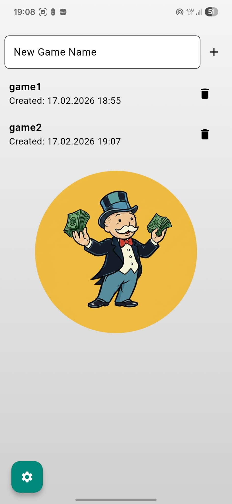
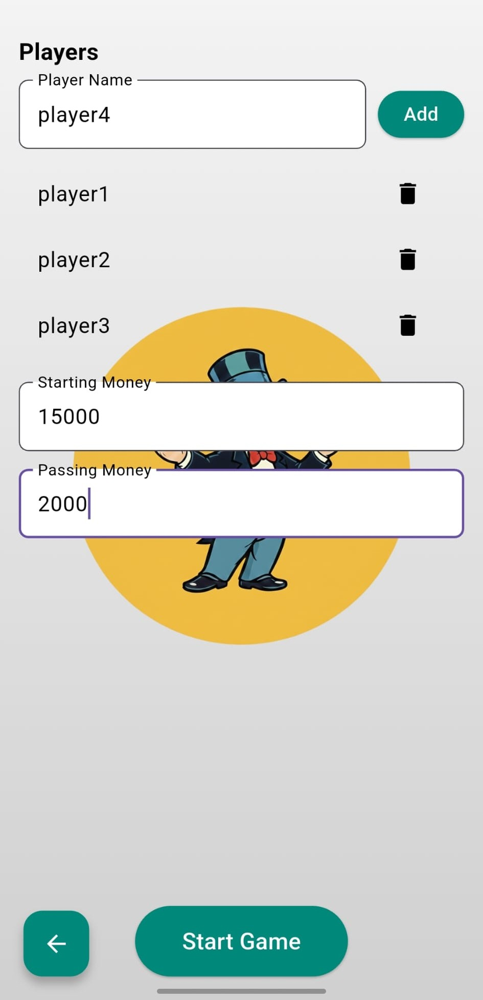
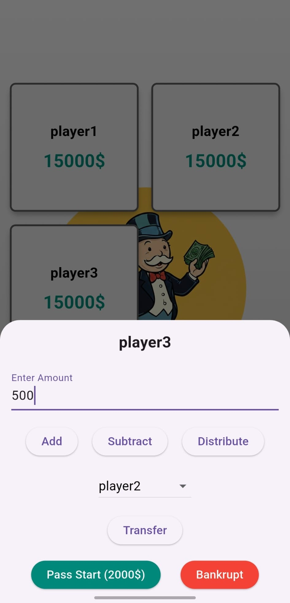
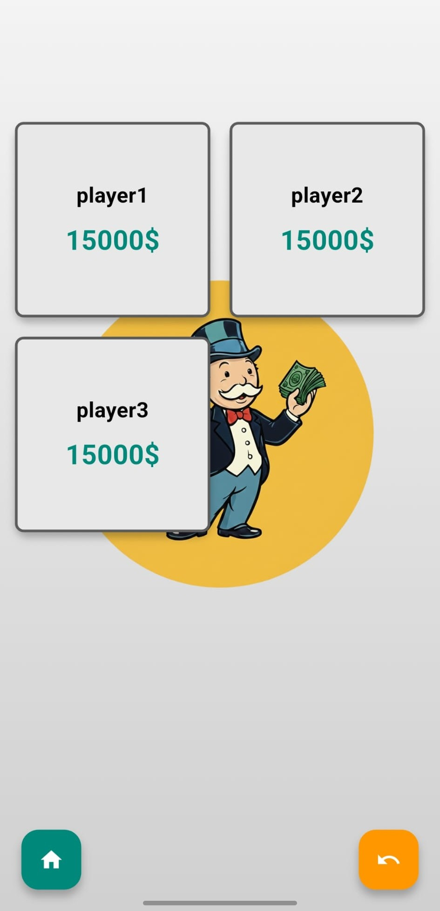

# Monopoly Banker

Monopoly Banker is a mobile application designed to simplify financial transactions for players in the Monopoly game. The app allows players to manage their balances, transfer money, and adjust game settings.

## Features
- Add and remove players
- Transfer money between players
- Set starting and passing money
- Multi-language support (Turkish and English)
- Mute mode

## Installation

### Requirements
- Flutter SDK (>=3.0.0)
- Android Studio or Xcode (for iOS)
- An Android or iOS device/simulator

### Steps
1. Clone this project:
   ```bash
   git clone https://github.com/username/monopoly_banker.git
   cd monopoly_banker
   ```
2. Install the required dependencies:
   ```bash
   flutter pub get
   ```
3. Run the application:
   ```bash
   flutter run
   ```

## Usage
1. Launch the application.
2. Create a new game and add players.
3. Manage player balances and perform transactions.

## Screenshots

| Main Screen | Game Setup Screen |
| :---: | :---: |
|  |  |

| Player Actions Screen | Game Screen |
| :---: | :---: |
|  |  |

## Contributing
To contribute, please submit a pull request or create an issue.

## License
This project is licensed under the MIT License. For more details, see the [LICENSE](LICENSE) file.
